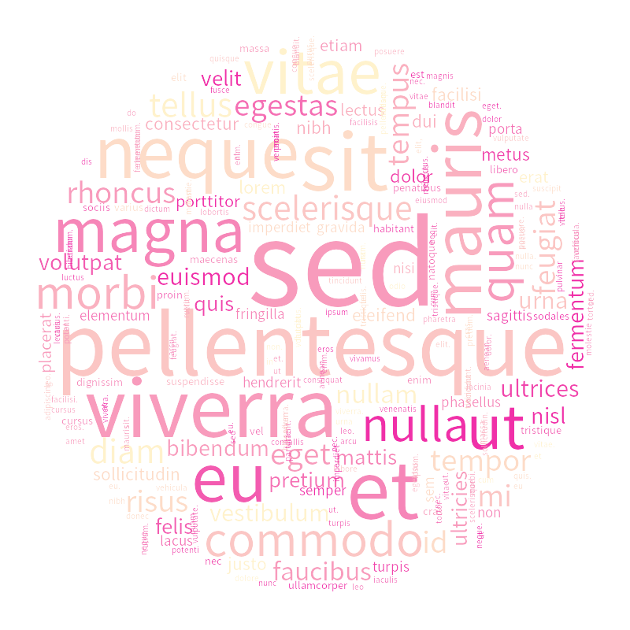

# mkcloud [](./LICENSE) [](https://docs.python.org/3/)

Wrapper for [wordcloud](https://github.com/amueller/word_cloud) python module; Generate **gradient-colored** round word clouds with Python3!



## Usage
```
mkcloud(filename, dic, theme_start, theme_end)
```
- `filename` : Filename(path) of output cloud
- `dic` : Dictionary of word & word frequency (example below)
```python
{
    'lorem': 2, 
    'ipsum': 1, 
    'dolor': 2, 
    'sit': 7, 
    'consectetur': 2, 
    (...)
}
```
- `theme_start` : Start color of gradient
- `theme_end` : End color of gradient

## See Also
- [Color gradients](https://gist.github.com/RoboDonut/83ec5909621a6037f275799032e97563) uploaded on gist by **RoboDonut** : `linear_gradient()` was used in this source
    * [Original post on blog](https://github.com/bsouthga/blog/blob/master/public/posts/color-gradients-with-python.md) by **bsouthga**
- [Word_cloud](https://github.com/amueller/word_cloud) by **amueller** : Greatest wordcloud module ever!
    * [Documentation](http://amueller.github.io/word_cloud/)
- [Google Noto Fonts](https://www.google.com/get/noto/) by **Google**(SIL Open Font License 1.1) : This module uses the font *NotoSansCJKkr-Regular*
